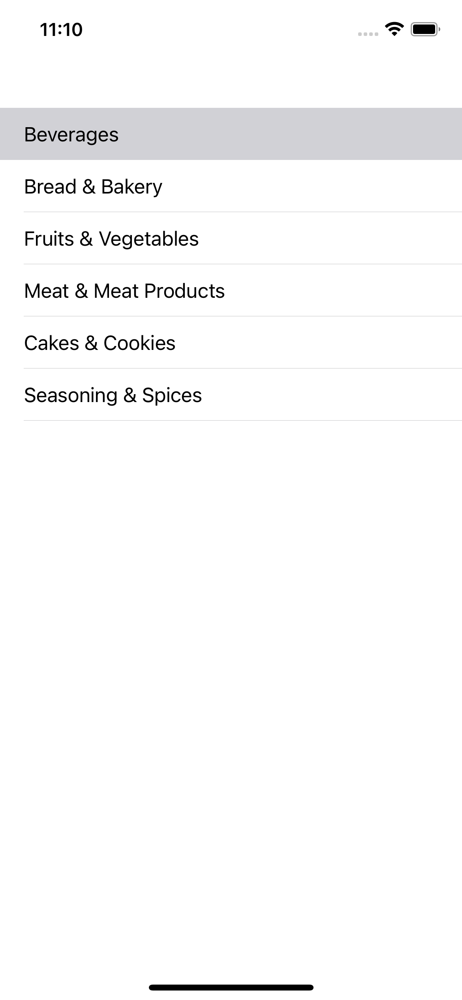
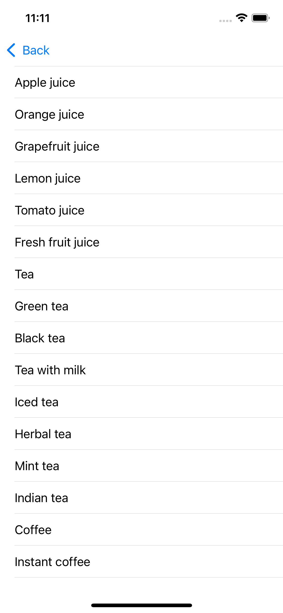
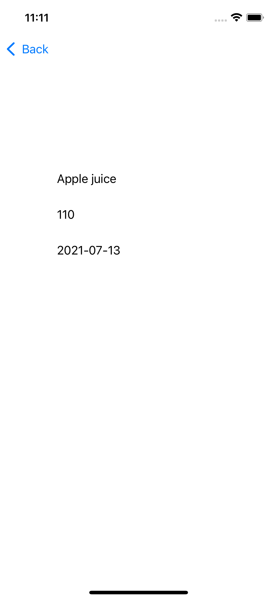

# ProductList
### Тестовое задание

## Задача
#### Написать приложение, состоящее из нескольких экранов и загружающее объекты для этих экранов их открытого API.
#### Требования к приложению:
#### https://github.com/surfstudio/Surf-iOS-Developers/blob/master/usefulMaterials/testProject.md

## Результат

![](Screenshots/Item.png
